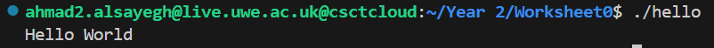
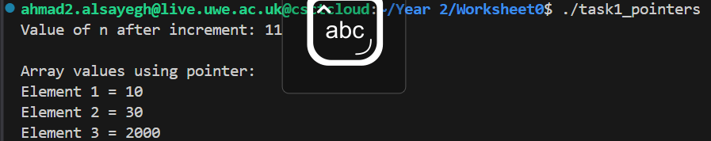
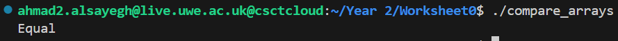
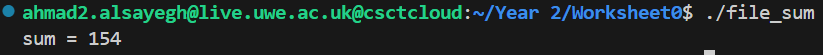
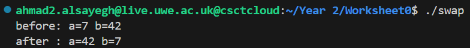
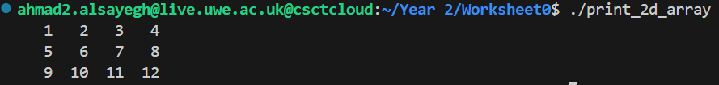
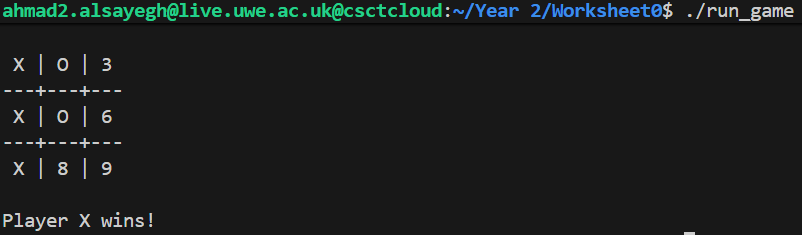

# Worksheet 0
## Task 1 (Hello World)

The first task was just a simple “Hello World” program to check that my compiler works.  
It prints Hello World to the terminal and shows that my setup is fine.

### Run
```bash
make hello
./hello
```

---

## Task 2 (Pointers)

I created an integer and changed its value using a pointer, then used another pointer to print out the values in an array.  
This helped me understand how memory addresses and pointer arithmetic works.

### Run
```bash
make task1_pointers
./task1_pointers
```

---

## Task 3 (Compare Arrays)

This one compares two arrays using pointers.  
If all the numbers in both arrays match, it prints “Equal”.  
If they don’t, it says “Not Equal”.  
Pretty straightforward but it showed how to loop through arrays with pointers.

### Run
```bash
make compare_arrays
./compare_arrays
```

---

## Task 4 (File Sum)

In this task, I learned how to read from a file.  
I made a file called `foo.txt` that has some numbers inside.  
The program reads them all, adds them up, and prints the total.  
It was my first time using `fopen` and `fscanf`, so it was really good practice.

### Run
```bash
make file_sum
./file_sum
```

---

## Task 5 (Swap)

This program swaps two values using a single generic function.  
It works for both integers and doubles using `void *` pointers.  
It was nice seeing how memory can be used to swap data types without rewriting code.

### Run
```bash
make swap
./swap
```

---

## Task 6 (Print 2D Array)

This one prints out a small 2x3 array using pointer arithmetic.  
Instead of using normal indexing, it accesses each number with a pointer, which helped me understand how 2D arrays work in memory.

### Run
```bash
make print_2d_array
./print_2d_array
```

---

## Task 7 (Run Game - Tic-Tac-Toe)

This was my favorite task.  
It’s a simple terminal-based Tic-Tac-Toe game where two players take turns typing numbers 1–9 to place their marks.  
The program checks for a winner or a draw and prints the board after every move.  
It’s split into three files (main.c, game.c, and game.h) which helped me understand modular programming in C.

### Run
```bash
make run_game
./run_game
```

---

## Task 8 (Makefile)

The Makefile automates everything.  
I can just type `make` to compile all programs, or `make clean` to delete the executables.  
It saves a lot of time and makes my folder nice and clean.

### Run
```bash
make
make clean
```

---

**Module:** UFCFWK-15-2 – Operating Systems  
**Student:** Ahmad Al-Sayegh  
**Student Number:** 23077452
